# Example

Based on the script <./example_scattering_1d.py>

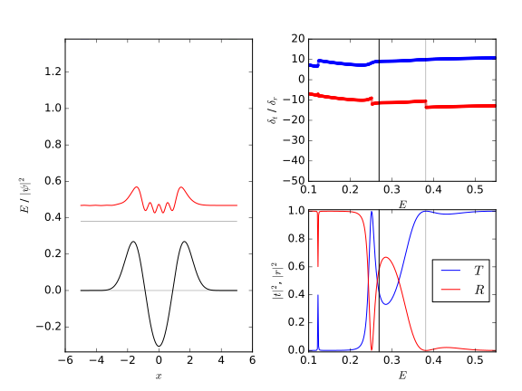

# Discretization

We use 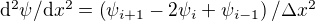
and define 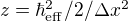
such that the Hamiltonian reads

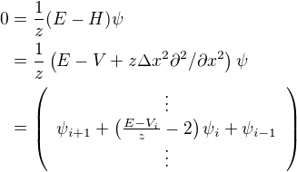

and therefore:

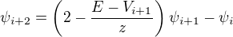

# Transfer Matrix

This allows to write a transfer matrix  from
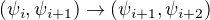
as

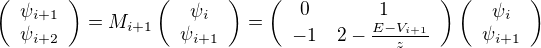

and

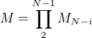

connecting the first two and the last two elements of 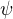:

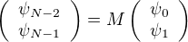

# Transmission and Reflection

These are linked to transmission and reflection via:

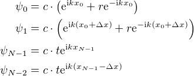

Choosing the global phase such that we can compare the phases at
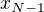, i.e. 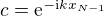, we get
with

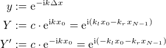

we have

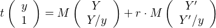

which in the code below are called
`t * g = c + r * d`, i.e.,

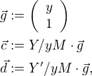

and which we can write as a linear system of equations
for  and 

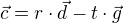

and we can rewrite this as

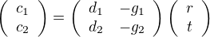

and therefore

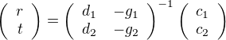

## Scattering Matrix

Note that we can more generally define:

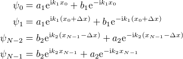

where we this time explicitly differentiate between the  values
on both sides: 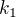 vs. 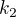. We use prefactors  for
incoming and  for outgoing components. Indices  correspond to
left (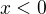), indices  to right (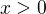).

With them the above becomes with
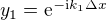,
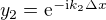,
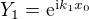, and
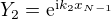 using

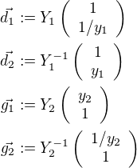

the following equation:

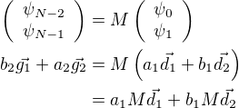

Such that we can map incoming to outgoing amplitudes

and therefore

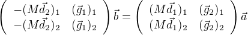

hence

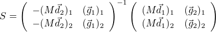

# See Also

<example_scattering_1d.md>: org file with details

[github repo](https://github.com/ricma/1d-qm-scattering)

